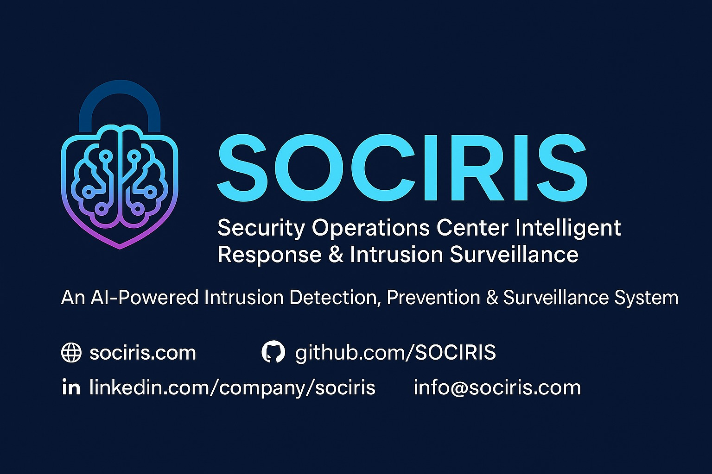

<div align="center">



# SOCIRIS — Security Intelligence Platform

**AI-Powered Autonomous Security Intelligence Platform**

Context-driven threat detection, OSINT fusion, SOAR automation, and multi-tenant enterprise security — deployable as SaaS, self-hosted, or air-gapped.

[](https://sociris.com)
[](https://github.com/SOCIRIS)

</div>

---

## Overview

SOCIRIS (Security Operations Center Intelligent Response & Intrusion Surveillance) is a production-grade security intelligence platform that evolved from a research project into a comprehensive enterprise solution. The platform combines:

- **Security Context Graph** — Organizational memory that enriches every alert with asset topology, ownership, blast radius, and investigation history
- **AI Cascade Architecture** — Lightweight triage model filters 70% of noise, then heavy deep-analysis model produces narrative reasoning chains
- **CD/CR Closed Loop** — Continuous Detection/Continuous Response transforms a linear pipeline into a self-improving loop
- **OSINT Intelligence Fusion** — 16+ real-time geospatial data layers fused by an 8-agent AI swarm
- **SOAR Automation** — 5 automated response playbooks with HITL verification gates
- **Multi-Tenant Enterprise** — Schema-per-tenant isolation, RBAC, SOC 2/ISO 27001/GDPR compliance

---

## Website Pages

| Page | Route | Description |
|------|-------|-------------|
| Home | `#/` | Hero, capabilities, real-time metrics, competitive comparison |
| Mission | `#/mission` | Mission statement, strategic pillars, design principles, impact targets, deployment models |
| Platform | `#/platform` | 7 core capabilities, end-to-end data flow architecture |
| Solutions | `#/solutions` | Problem/solution comparison, 8 industry verticals, key benefits |
| Technology | `#/technology` | 6 evolution phases, tech stack, 13 integrations |
| Demo | `#/demo` | Interactive Situation Room with real-time threat feed, AI investigation, SOAR simulation |
| About | `#/about` | Vision, mission, timeline, core values, platform scale |
| Contact | `#/contact` | Contact form, FAQ with 8 questions |

---

## Interactive Demo

The Demo page (`#/demo`) features a fully interactive Situation Room simulation:

- **Real-Time Threat Feed** — Animated alert stream with MITRE ATT&CK technique mapping
- **AI Investigation Engine** — Step-by-step cascade visualization (triage → context → deep analysis → HITL → response)
- **Geospatial Situation Room** — World map with animated threat markers
- **SOAR Playbook Execution** — Click "Execute Playbook" to see step-by-step automation
- **Detection Accuracy Ring** — Animated SVG ring chart showing ensemble model composition
- **Alert Distribution Bars** — Animated progress bars by severity
- **Dashboard Metrics** — Animated counter cards for threats detected, response time, coverage
- **Security Context Graph** — Interactive node graph showing organizational memory
- **Narrative Reasoning** — Side-by-side comparison: traditional numeric score vs. SOCIRIS investigation narrative
- **CD/CR Pipeline** — Horizontal timeline showing the self-improving loop

---

## Tech Stack (Website)

| Layer | Technology |
|-------|-----------|
| Architecture | Single-page application (hash-based router) |
| Styling | CSS custom properties, modular CSS files |
| Icons | Lucide Icons |
| Fonts | Inter (Google Fonts) |
| Animations | CSS keyframes, IntersectionObserver scroll animations |
| Interactivity | Vanilla JavaScript, Canvas-free simulations |
| Theme | Dark/light mode with localStorage persistence |
| Deployment | GitHub Pages with custom domain |

---

## File Structure

```
Launchpad/
├── index.html                    # SPA shell with nav, footer, scripts
├── CNAME                         # Custom domain (sociris.com)
├── README.md
├── site/
│   ├── css/
│   │   ├── variables.css         # CSS custom properties, theme tokens
│   │   ├── base.css              # Reset, typography, animations
│   │   ├── components.css        # Buttons, cards, dashboard, charts, modals
│   │   ├── sections.css          # Hero, page heroes, demo, mission sections
│   │   └── responsive.css        # Tablet + mobile breakpoints
│   ├── js/
│   │   ├── helpers.js            # HTML generators (icons, cards, charts, etc.)
│   │   ├── demo.js               # Interactive demo engine (threat feed, SOAR, etc.)
│   │   ├── pages.js              # All page render functions + init hooks
│   │   ├── theme.js              # Dark/light theme toggle + persistence
│   │   ├── router.js             # Hash-based SPA router with fade observers
│   │   └── app.js                # App initialization, nav, scroll, hash change
│   └── images/
│       ├── sociris-logo-dark.jpeg
│       ├── sociris-logo-light.jpeg
│       ├── sociris-wide-logo-dark.jpeg
│       └── sociris-wide-logo-light.jpeg
├── css/                          # Legacy styles (not used by current site)
├── js/                           # Legacy scripts (not used by current site)
└── docs/                         # Documentation assets
```

---

## Quick Start

```bash
# Clone
git clone https://github.com/SOCIRIS/Launchpad.git
cd Launchpad

# Serve locally
python3 -m http.server 8000

# Open
open http://localhost:8000
```

---

## SOCIRIS Platform Architecture

### Current → Evolved

```
CURRENT (FYP)                          EVOLVED (Commercial)
┌──────────────────────┐               ┌──────────────────────────────────┐
│ Static HTML Dashboard │               │ Next.js + MapLibre + CesiumJS    │
│ (12 pages, vanilla JS)│               │ + Ant Design + ECharts + 3D Globe│
└──────────┬───────────┘               └──────────────┬───────────────────┘
           │                                          │
┌──────────▼───────────┐               ┌──────────────▼───────────────────┐
│ Monolithic FastAPI    │               │ Modular FastAPI (routers+services)│
│ (4300 lines, 1 file)  │               │ + Context Graph + OSINT Pipeline  │
└──────────┬───────────┘               └──────────────┬───────────────────┘
           │                                          │
┌──────────▼───────────┐               ┌──────────────▼───────────────────┐
│ Numeric Risk Score    │               │ AI Cascade + Narrative Reasoning  │
│ (0-100, no memory)    │               │ + CD/CR Loop + Context Graph      │
└──────────┬───────────┘               └──────────────┬───────────────────┘
           │                                          │
┌──────────▼───────────┐               ┌──────────────▼───────────────────┐
│ Linear Pipeline       │               │ HITL Gate → Response → Feedback   │
│ Detect→Score→Playbook │               │ → Better Detection → Repeat       │
└──────────┬───────────┘               └──────────────┬───────────────────┘
           │                                          │
┌──────────▼───────────┐               ┌──────────────▼───────────────────┐
│ 28 Docker Services    │               │ K8s/Helm + Edge Sensors + SaaS    │
│ (Single deployment)   │               │ + Multi-tenant + Air-gapped       │
└──────────────────────┘               └──────────────────────────────────┘
```

### Six Evolution Phases

| Phase | Focus | Key Deliverables |
|-------|-------|-----------------|
| 0 | Foundation Refactor | Modular FastAPI, Next.js dashboard, Keycloak SSO, Vault, CI/CD |
| 1 | Context Graph + CD/CR | Neo4j/AGE graph, AI cascade, HITL gates, detection compression |
| 2 | OSINT Fusion | 16+ geospatial layers, RECON toolkit, 8-agent swarm, attack surface |
| 3 | Enterprise Platform | Multi-tenancy, SOC 2/ISO 27001/GDPR, HA/DR, edge sensors |
| 4 | Intelligence Products | Investigation reports, executive dashboard, analyst upskilling |
| 5 | Ecosystem | Plugin marketplace (13 integrations), GraphQL API, community hub |

---

## Key Differentiators

| vs. Traditional SIEM/SOAR | SOCIRIS Advantage |
|--------------------------|-------------------|
| Rules decay, manual tuning | CD/CR auto-generates and retires detections |
| No organizational memory | Security Context Graph persists knowledge |
| Detection-only or response-only | Unified reasoning loop |
| No OSINT fusion | 16+ real-time geospatial layers |
| No physical security | Face recognition + GPS + CCTV |
| Cloud-dependent | SaaS + Self-hosted + Air-gapped + Edge |

---

## Deployment Models

- **SaaS Cloud** — Managed SOCIRIS with web signup and auto-scaling
- **Self-Hosted** — Docker Compose or Helm chart, full infrastructure control
- **Air-Gapped** — Local LLM (Ollama), offline threat feeds, government/defense ready
- **Edge Sensors** — Lightweight Go binary, autonomous operation, MSSP model

---

## Change Log

### Version 3.0 (Current — Complete Overhaul)
- Rewrote entire site as single-page application with hash-based router
- Added 8 pages: Home, Mission, Platform, Solutions, Technology, Demo, About, Contact
- Built interactive Situation Room demo with real-time threat feed simulation
- Added AI investigation cascade visualization with animated steps
- Added SOAR playbook execution simulation
- Added geospatial situation room with animated threat markers
- Added Security Context Graph interactive node visualization
- Added narrative reasoning comparison (before/after code blocks)
- Added CD/CR pipeline horizontal timeline
- Added competitive comparison grid
- Added animated counter metrics, ring charts, progress bars
- Added mission statement page with strategic pillars and design principles
- Added dark/light theme with smooth transitions
- Modular CSS architecture (5 files)
- Modular JS architecture (6 files)
- All animations use IntersectionObserver for scroll-triggered reveals
- Full responsive design (desktop, tablet, mobile)
- Enhanced SEO with structured data (Organization + WebSite schemas)

### Version 2.2 (Logo Integration)
- Integrated official SOCIRIS logos
- Added favicon, Open Graph, and Twitter Card meta tags

### Version 2.0 (Symmetric Layout)
- 7 service components, 8 use cases, card-based technology section

### Version 1.0 (Initial)
- Static HTML landing page

---

## Contact

- **Email**: [info@sociris.com](mailto:info@sociris.com)
- **LinkedIn**: [/company/sociris](https://www.linkedin.com/company/sociris/)
- **GitHub**: [github.com/SOCIRIS](https://github.com/SOCIRIS)
- **Location**: Karachi, Pakistan

---

<div align="center">

**Built by the SOCIRIS Team**

*Context-driven, AI-native security intelligence for every organization*

</div>
